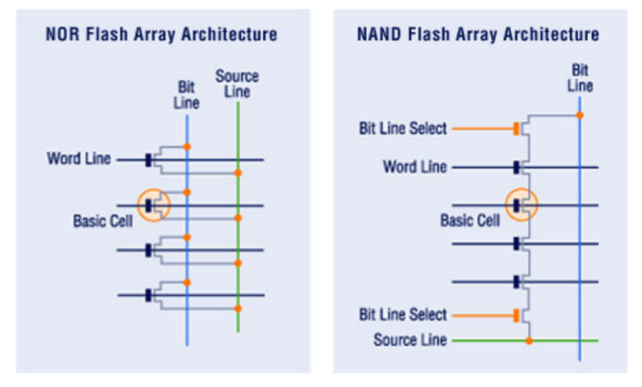
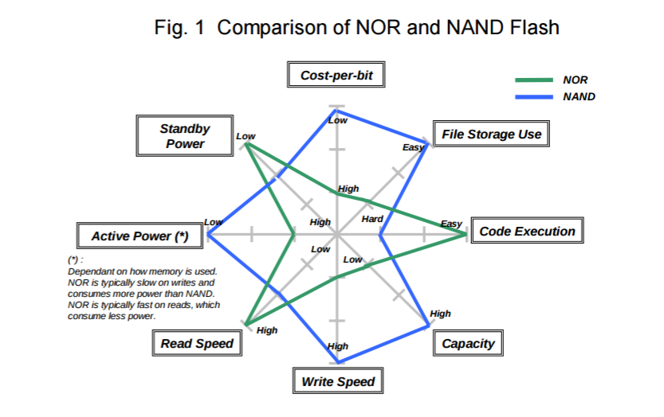
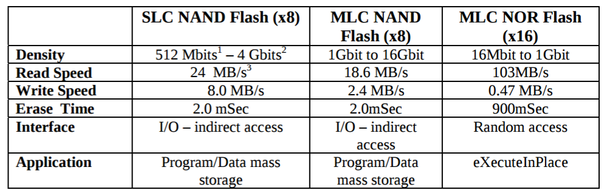
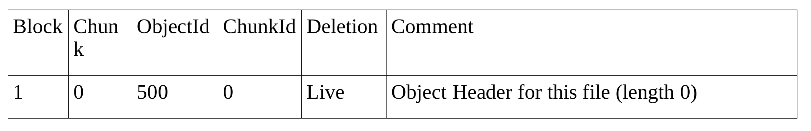
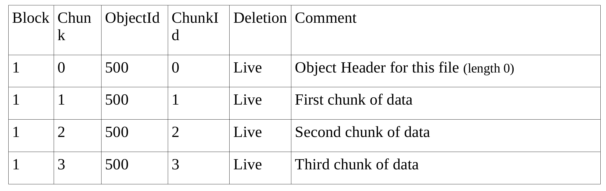
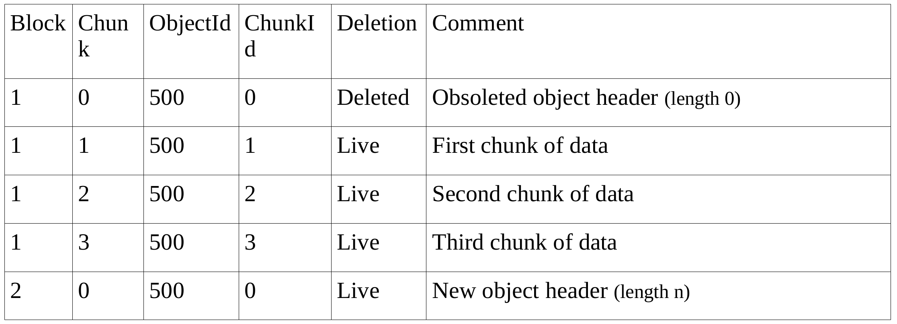
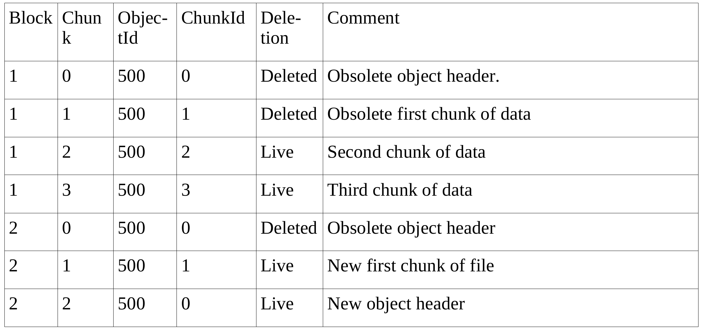
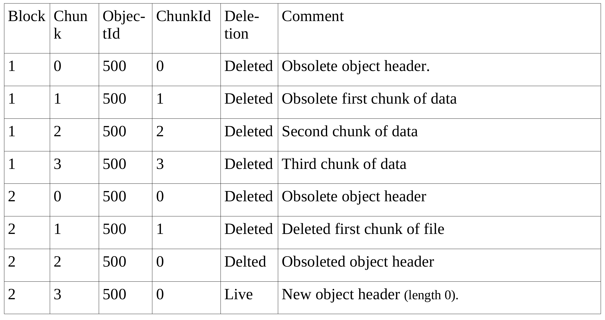
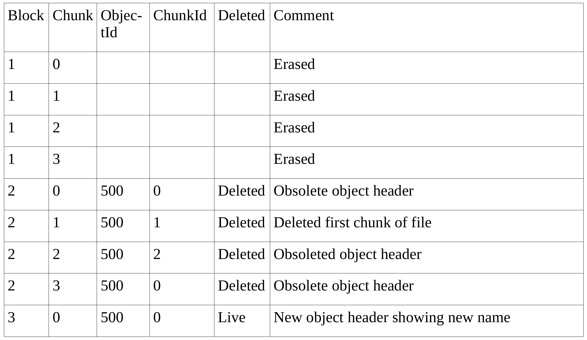

Background
==========

In order to understand how a low power file system works, it requires to understand how underling system works, namely the flash memory and the file-system.

.. _flash_memory:

Flash Memory
------------

This chapter give an overview of the flash memory technology and highlight the features that are to be taken in account when designing flash file-systems.

The first important thing to know is that there is two main flash memory technology, namely NAND and NOR. They differs on how the memory cell are wired on the silicon, as shown by :numref:`flash_micro_arch`. In NOR memories, the cells are arranged in parallel forming a not OR function, hence its name. NAND memories are respectively wired in series forming a not AND function.

.. _flash_micro_arch:

	NAND and NOR micro-architecture [Tal]_

Both technologies have strength and weakness as shown by :numref:`flash_nand_nor_comp`. But they are tree key in the selection of NAND vs NOR. 

First, thing is the density (for a given lithography process), where NAND have much higher density, each memory cell taking less space on the dice. This also impact the price per byte, making the NAND cheaper for same capacity. 
. 

.. _flash_nand_nor_comp:

	NAND vs NOR feature comparison [Toshiba]_

The second aspect to consider is how the memory can be accessed. NOR memory can be read and written randomly as NAND memory must read and written by pages. A page is generally 4KBytes, but its size can change on some chip. But both memory type must be erased before being written and in both case the erasing must be done by block. An erase block is generally 32 to 128 pages big. The erasing of a page turn every bit to '1', writing is turning the necessary bit to '0', leaving the other to '1'.

The third aspect to consider is the access speed, which can be seen in :numref:`flash_nand_nor_speed`. The NOR flash is faster to read, thanks to its parallel micro-architecture, but NAND is much faster to erase and write. It is to note that NAND and NOR power consumption per byte is comparable, so the most important parameter in regards to the energy usage of both technologies is the access time.

	
.. _flash_nand_nor_speed:

	NAND vs NOR speed comparison [Toshiba]_

This observation makes the NOR flash memory more suitable for code memory, where the program is written once and then read randomly very often. NAND flash is more suitable for data-storage applications thanks to its higher density, lower price per bit and lower write time. Most of flash file-systems are therefore optimized for NAND technology. 

Finally it is also important to know that NAND are more susceptible to failure having "bad blocks", that can be present on device at commissioning or that can arrive during the lifespan of the device.

Those aspect of the flash way of functioning should be handled by the file-system.

Flash File systems
------------------

This chapter gives an over-view of how a flash file system works. In order to understand how we can archive low-power file-system it is important to have a basic understanding on how a file system works. Here after we show how a given flash file system, namely *yaffs*, works in a step-by-step sequence. Yaffs was chosen for this example because it is well documented in [yaffs]_. The illustration in this chapter are taken out of this document. 

In yaffs, every item for the file-system, like directories, hard-link, symbolic links, special files, regular files, are referenced as "*object*". Every *object* is stored in one or more *chunk*. A *chunk* is a piece of information that is a sub-multiple of a page in size. Each *chunk* contains the following informations:

:ObjectID: Tell to which *object* the *chunk* belong to. 
:ChunkID: Sequence number of the chunk within the same *object*. Chunk with ID zero it the object header.
:Status: Tell the status of the chunk, if it is been used or deleted.
:Data: Actual content of the file. A whole file is made of one or more *chunks*.

In the illustrations of this chapter, the presented table show those elements as well as other informative element. The "Block" column represent the erase block number of the underling flash memory (see chapter ":ref:`flash_memory`") 

The creation of an *object* (let's assume a file) create the following chunk (see :numref:`create`):

.. _create:

	File creation

We can see that the file-system created  *chunk* with ID zero for the object 500. This chunk is the file header, just telling the the file exist and is opened.

One the file is written, it creates sub-sequent chunk with the content of the files. The :numref:`write` show that the file content take now 3 more chunks:

.. _write:

	File Write

When the file is closed, a new file header must be created, because the status of the file (*opened* or *closed*) is part of the header. This will mark the old *chunk* in line one as deleted. This is done by clearing some bit inside the flash memory, so in can be done as a write-over (no erase need to be done to clear new bits during the write-over). We can see in :numref:`close` that the new object header is placed in another erase block. 

.. _close:

	File Closed

If the file is now re-opened and the begin of the file is rewritten (let's say the first *chunk*), old *chunk* and the file header will be marked as deleted and new *chunk* with ID 1 and file header will be created in succession, as shown by :numref:`rewrite`.

.. _rewrite:

	File Rewrite

:numref:`clean` show what append if we decide to flush the file of its content, we just mark all *chunk* with ID greater that 0 to *deleted* status. The file header should also be rewritten because it contains the file length. 

.. _clean:

	File emptying

Now that an whole erase block contains only "*deleted*" chunks its memory can be collected by performing the erase of the block. This result into the :numref:`mem_colection`. This block can then be re-used to place new chunks.

.. _mem_colection:

It is to note that the flash file-system has many other task to do along the process shown above. It has to manage fragmentation (many blocks occupied by few *chunk* can be copied and block can then be collected), wear leveling and bad-block has to be managed, and compression is generally used to optimize the use of the flash memory.

Wear-leveling is the process of using all page of the flash before re-using them in order to distribute the wear. Flash memory pages have a limited life-span to a certain amount of writes (typically 10k-100k) before they begin to have bad-blocks. 

.. [Tal] Two Flash Technologies Compared: NOR vs NAND, Arie Tal, M-Systems, October 2002

.. [Toshiba] NAND vs. NOR Flash Memory Technology Overview, Toshiba America Electronic components inc.

.. [yaffs] How YAFFS works, Charles Manning, 28.03.2012.