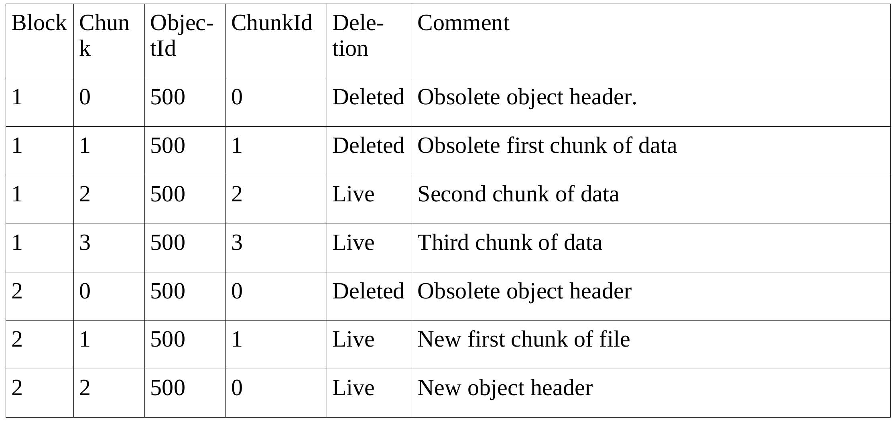
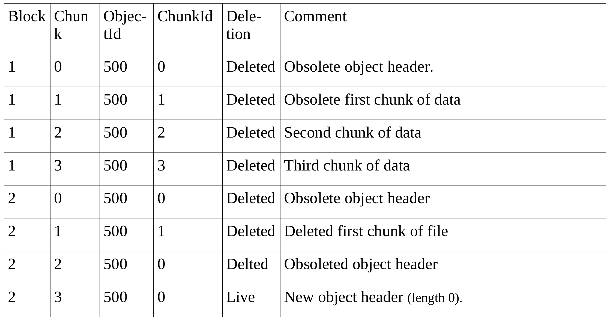

Flash File systems
==================

This chapter gives an over-view of how a flash file system works. In order to understand how we can archive low-power file-system it is important to have a basic understanding on how a file system works. Here after we show how a given flash file system, namely *yaffs*, works in a step, by step sequence. Yaffs was chosen for this example because it is paticulray well documented in [yaffs]_. Tthe illustration in this chapter are taken out of this document ([yaffs]_. 

In yaffs, every item for the file-system, like directories, hard-link, symbolic links, special files, regular files, are referenced as "*object*". Every *object* is stored in one or more *chunk*. A *chunk* is a piece of information that is a sub-multiple of a page in size. Each *chunk* contains the following informations:

:ObjectID: Tell to which *object* the *chunk* belong to. 
:ChunkID: Sequence number of the chunk within the same *object*. Chunk with ID zero it the object header.
:Status: Tell the status of the chunk, if it is been used or deleted.
:Data: Actual content of the file. A whole file is made of one or more *chunks*.

In the illustrations of this chapter, the presented table show those elements as well as other informative element. The "Block" column represent the erase block number of the underling flash memory (see chapter ":ref:`flash_memory`") 

The creation of an *object* (let's assume a file) create the following chunk (see :numref:`create`):

.. _create:
.. figure:: figures/yaffs_-_1._Create.png
	:scale: 35%

	File creation

We can see that the file-system created  *chunk* with ID zero for the object 500. This chunk is the file header, just telling the the file exist and is opened.

One the file is written, it creates sub-sequent chunk with the content of the files. The :numref:`write` show that the file content take now 3 more chunks:

.. _write:
.. figure:: figures/yaffs_-_2._Write.png
	:scale: 35%

	File Write

When the file is closed, a new file header must be created, because the status of the file (*opened* or *closed*) is part of the header. This will mark the old *chunk* in line one as deleted. This is done by clearing some bit inside the flash memory, so in can be done as a write-over (no erase need to be done to clear new bits during the write-over). We can see in :numref:`close` that the new object header is placed in another erase block. 

.. _close:
.. figure:: figures/yaffs_-_3._Closing.png
	:scale: 35%

	File Closed

If the file is now re-opened and the begin of the file is rewritten (let's say the first *chunk*), old *chunk* and the file header will be marked as deleted and new *chunk* with ID 1 and file header will be created in succession, as shown by :numref:`rewrite`.

.. _rewrite:

	File Rewrite

:numref:`clean` show what append if we decide to flush the file of its content, we just mark all *chunk* with ID greater that 0 to *deleted* status. The file header should also be rewritten because it contains the file length. 

.. _clean:

	File emptying

Now that an whole erase block contains only "*deleted*" chunks its memory can be collected by performing the erase of the block. This result into the :numref:`mem_colection`. This block can then be re-used to place new chunks.

.. _mem_colection:
.. figure:: figures/yaffs_-_6._Memory_collection.png
	:scale: 35%

It is to note that the flash file-system has many other task to do along the process shown above. It has to manage fragmentation (many blocks ocuppied by few *chunk* can be copied and block can then be collected), wear leveling and bad-block has to be managed, and compression is generally used to optimize the use of the flash memory.

Wear-leveling is the process of using all page of the flash before re-using them in order to distribute the wear. Flash memory pages have only life-span a certain amount of writes (typically 10k-100k) before they begin to have bad-blocks. 

.. [yaffs] How YAFFS works, Charles Manning, 28.03.2012.