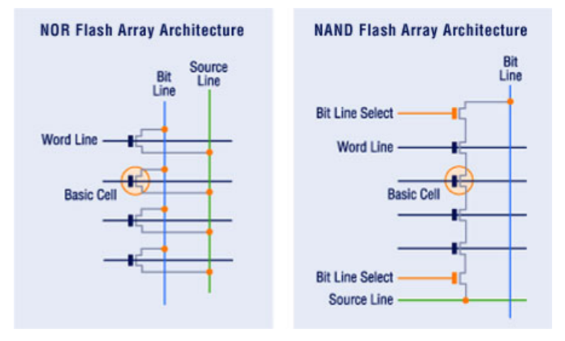

FLASH Memory
============

This chapter give an overview of the FLASH memory technology and highlight the features that are to be taken in account when designing FLASH file-systems.

The first important thing to know is that there is two main FLASH memory technology, namely NAND and NOR. They differs on how the memory cell are wired on the silicon, as shown by :numref:`flash_micro_arch`. In NOR memories, the cells are arranged in parallel forming a not OR function, hence its name. NAND memories are respectively wired in series forming a not AND function.

.. _flash_micro_arch:

	NAND and NOR micro-architecture [Tal]_

Both technologies have strength and weakness as shown by :numref:`flash_nand_nor_comp`. But they are tree key in the selection of NAND vs NOR. First, thing is the density (for a given lithography process), where NAND have much higher density, each memory cell taking less space on the dice. This also impact the price per byte. 
. 

.. _flash_nand_nor_comp:
.. figure:: figures/FLASH_memory_-_NAND_NOR_comp.png
	:scale: 35%

	NAND vs NOR feature comparison [Toshiba]_

The second aspect to consider is how the memory can be accessed. NOR memory can be read and written randomly as NAND memory must read and written by pages. But both memory type must be erased before being written and in both case the erasing must be done by page. The erasing of a page turn every bit to '1', writing is turning the necessary bit to '0', leaving the other to '0'.

The third aspect to consider is the access speed, which can be seen in :numref:`flash_nand_nor_speed`. As one can see, the NOR flash is faster to read, thanks to its parallel micro-architecture, but NAND is much faster to erase and write. It is to note that NAND and NOR power consumption per byte is comparable, so the most important parameter in regards to the energy usage of both technologies is the access time.

	
.. _flash_nand_nor_speed:
.. figure:: figures/FLASH_memory_-_NAND_NOR_speed_comp.png
	:scale: 35%

	NAND vs NOR speed comparison [Toshiba]_

This observation makes the NOR FLASH memory more suitable for code memory, where the program is written once and then read randomly very often. NAND FLASH is more suitable for data-storage thanks to its higher density, lower price per bit and lower write time. Most of FLASH file-systems are therefore optimized for NAND technology. 

Finally it is also important to know that NAND are more susceptible to failure having "bad blocks", that can be present on device at commissioning or that can arrive during the lifespan of the device.

Those aspect of the FLASH way of functioning should be handled by the file-system.

.. [Tal] Two Flash Technologies Compared: NOR vs NAND, Arie Tal, M-Systems, October 2002

.. [Toshiba] NAND vs. NOR Flash Memory Technology Overview, Toshiba America Electronic components inc.