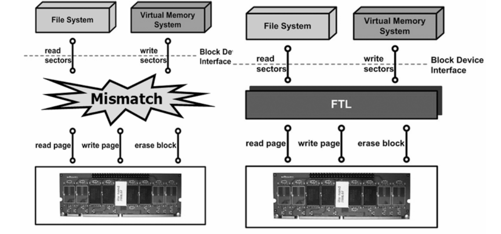
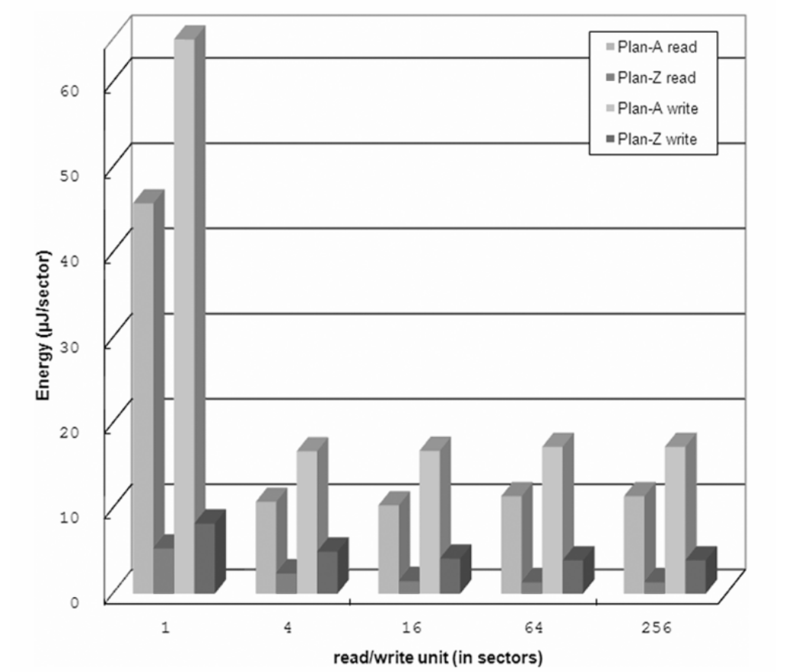

Optimizations
=============

There is not "low-power file-system" in a general manner. But flash file-systems can be optimized in order to reduce they power consumptions. This chapter give an overview of directed techniques that can be use to archive low-power on file-systems. All those technique have been studied in referenced articles.

FTL implementation in hardware
------------------------------

Traditional file-systems - like ext3, FAT ReisenerFS, etc - are targeted to hard drives which have a different access model to the flash memory. Hard-drive access model are imposed by the spinning disk and is based on sectors that can be read or written atomically. A sector is 512 bytes and must be read or written at one. So the hard drive access model is sector read or write. This model is called "Block device interface"

Flash memory have different access model, with Page read or write and block erase (see chapter ":ref:`flash_memory`"). A page is generally 4KBytes and a block gather many page for erase.

So when using an traditional file-system on flash-memory, a special layer called "Flash Translation Layer" FTL must be used to convert for the hard-drive  access model to the flash access model. This FTL must also handle the problem specific to the flash memory like Error correction, bad-block detection and wear leveling. The FTL principle is show by :numref:`flt_principle`.

.. _flt_principle:

	FTL principle

FTL are generally implemented as as software piece that is placed between the file-system and the flash memory driver. One optimization that can done is to replace this software FTL by some hardware FTL that offers and block device interface and drives the flash memory directly. Replacing software pieces by hardware function ofter speed-up the process by several times and thus reduce the power consumption.

The article [HW-FTL] shows the comparison of a prototype hardware FTL called "Plan-Z" again a software FTL called "Plan-A". The prototype FTL is implemented using a FPGA that is present on a mezzanine card connected to the host CPU and embedding the flash memory chips. Power of the system is then measured using some data aquisition device and synchronized with the test program. Results are the shown in :numref:`ftl_comp`.

.. _ftl_comp:

	Software FTL vs Hardware FTL energy consumption comparison.

Choice of the File system
-------------------------

Compression optimization by prediction
--------------------------------------

Compression optimization on the fly
-----------------------------------

Optimization of the page cache
------------------------------

.. EXT3 vs JFFS2

[EXT3-JFFS] "Energy Characterization of Filesystems for DisklessEmbedded Systems",S. Choudhuri et R. N. Mahapatra

.. Prediction base compression

[Comp1] "Adaptive Filesystem Compression for Embedded Systems", L. S. Bai, H. Lekatsas et R. P. Dick

.. On the fly compression

[Comp2] "Improving energy efficiency for flash memory based embedded application", H. Song, S. Choi, H. Cha, et R. Ha

.. HW FTL

[HW-FTL] "Flash Memory-based Storage Device for Mobile Embedded Applications", i. Choi, Ki Seok C

[JFFS] "JFFS: The Journalling Flash File System", D. Woodhouse