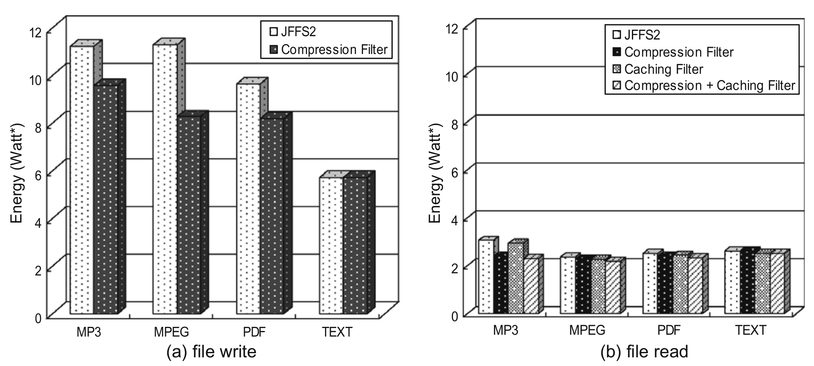

Optimizations
=============

There is not "low-power file-system" in a general manner. But flash file-systems can be optimized in order to reduce they power consumptions. This chapter give an overview of directed techniques that can be use to archive low-power on file-systems. All those technique have been studied in referenced articles.

FTL implementation in hardware
------------------------------

Traditional file-systems - like ext3, FAT ReisenerFS, etc - are targeted to hard drives which have a different access model to the flash memory. Hard-drive access model are imposed by the spinning disk and is based on sectors that can be read or written atomically. A sector is 512 bytes and must be read or written at one. So the hard drive access model is sector read or write. This model is called "Block device interface"

Flash memory have different access model, with Page read or write and block erase (see chapter ":ref:`flash_memory`"). A page is generally 4KBytes and a block gather many page for erase.

So when using an traditional file-system on flash-memory, a special layer called "Flash Translation Layer" FTL must be used to convert for the hard-drive  access model to the flash access model. This FTL must also handle the problem specific to the flash memory like Error correction, bad-block detection and wear leveling. The FTL principle is show by :numref:`flt_principle`.

.. _flt_principle:
.. figure:: figures/FTL_-_principle.png
	:scale: 35%

	FTL principle

FTL are generally implemented as as software piece that is placed between the file-system and the flash memory driver. One optimization that can done is to replace this software FTL by some hardware FTL that offers and block device interface and drives the flash memory directly. Replacing software pieces by hardware function ofter speed-up the process by several times and thus reduce the power consumption.

The article [HW-FTL]_ shows the comparison of a prototype hardware FTL called "Plan-Z" again a software FTL called "Plan-A". The prototype FTL is implemented using a FPGA that is present on a mezzanine card connected to the host CPU and embedding the flash memory chips. Power of the system is then measured using some data aquisition device and synchronized with the test program. Results are the shown in :numref:`ftl_comp`.  It shows that using an hardware FTL can decrease the power consumed by the file storage (file-system, FTL and hardware) more that five times, for both read and write. The gain is event larger when the size of the read write is above four sectors. Then it become quasi constant.

.. _ftl_comp:

	Software FTL vs Hardware FTL energy consumption comparison.

Choice of the File system
-------------------------

One optimization that can be done to minimize the power consumption of the file-system is to chose the right one. The paper [EXT3-JFFS]_ is not directly related to this topic but on how to measure the power consumption of a file system. To demonstrate there acquisition system, they take an "school case": They measure the consumption of *ext3* vs *JFFS* on an embedded system that use flash memory as storage. They measure both the consumption of the host process and the consumption of the flash memory separately.  It is a "school case" because *ext3* is a pure "block device" file system intended for hard-drivers and requires an FTL. In the other size, JFFS is targeted to flash memory.

In the article, the authors measure the energy measured by various system calls (like create a file, read, write, link, mkdir, rename, etc..). Those data can be seen in :numref:`cpu_energy_by_syscall`, :numref:`ext3_flash_energy_by_syscall` and :numref:`jffs_flash_energy_by_syscall`.

.. _cpu_energy_by_syscall:

	Energy consumed by the CPU by syscall.

.. _ext3_flash_energy_by_syscall:

	Ext3: flash energy consumed b by syscall

.. _jffs_flash_energy_by_syscall:

	JFFS: flash energy consumed b by syscall

The above figure shows that the energy consumed by JFFS 2 lower in most case on the flash memory but is almost equal on the CPU. It is interesting to note that *JFFS2* consume less that *ext3* on write but more on read. The excess in read of JFFS2 is probably due to decompression (JFFS2 use compression).

They also measure the power consumption in regards to the length of the data that is been written. The measurement was done again for the CPU and for the flash memory.
The result of those measurement can be seen in :numref:`fs_cpu_energy_by_size` and :numref:`fs_flashenergy_by_size`.

.. _fs_cpu_energy_by_size:

	Ext3 and JFFS CPU energy vs write size.

.. _fs_flashenergy_by_size:

	Ext3 and JFFS CPU energy vs write size.

Those figure shows that *JFFS2* exceeds *ext3* on the processor as long that that is bigger than ~200Byte (sector size ?). On the flash memory side, JFFS2 exceed *ext3* on all case, but both thens to join on high file sizes. 

Compression optimization by prediction
--------------------------------------

As seen before, flash file-system use compression. They do-so because, the write process take long time. Specially the erase that is done lazy, that meas it done when the free space is required, not when it is free. So minimizing the amount of data to write, by compression, is minimizing the consumed energy.

But in certain case, this compression done by the file-system is making consume more energy. Take the case of a file that is often modified. In that case, compressing and de-compressing it all the time can turn to a waist of energy.

The article [Comp1]_ study a technique that tries to minimize the energy consumed by the compression, by analyzing the frequency at which a file is accessed and the effort of each compression. The total cost of the compression for a given file is then the product of the access frequency and the compression effort. It this effort is bigger that a certain threshold, then the compression does not worth and is skipped. The algorithm proposed keep statistic of the access of each files and compute the cost dynamically at runtime creating a prediction algorithm to choose when to compress or not on the beginning of each access.

The article then make a measurement of the performance of various compression optimization technique and compare them to the proposed technique. For this thest is use 5 different "file traces" that are predefined sequence of file access defined as shown in :numref:`file_traces`. 

.. _file_traces:

	File trace used to test the compression prediction algorithms

The tested algorithm are the following:

:Random: Generally not compress. Compress randomly other files when space is missing.
:Uniform: Lazy compression of all files.
:LRU Promote: Does not compress recently used files.
:F MCKP: The proposed prediction algorithm.
:Oracle F MCKP: This is not a real algorithm. This solution knows is advance the future use of each files and follow the best possible solution, that has been pre-calculated by knowing the file-traces.

For each file trace and for each algorithm, the access time has been measured. The result of this measurement is shown in :numref:`comp_opt_by_prediction_access_time`.

.. _comp_opt_by_prediction_access_time:

	File trace used to test the compression prediction algorithms

This shows that the prediction algorithm offers shorter access time for each test case (file trace). We can see that the proposed solution is close the the perfect solution provided by the *Oracle F MCKP*.

The :numref:`comp_opt_by_prediction_resluts` shows how the different techniques compares. 

.. _comp_opt_by_prediction_resluts:

	File trace used to test the compression prediction algorithms

It this plot, the energy is represented normalized to the energy consumed by the proposed algorithm (*F MCKP*). We can see that the others solutions consume 1.5 to 3.5 more energy that the proposed algorithm.

Compression optimization on the fly
-----------------------------------

The scientific paper [Comp2]_ offers another postulate to optimize when the compression should be used by the file-system and when not: Certain files are already compressed by the application, like MPEG, JPEG, MP3 or PDF. Compressing those files again will be a waist of time, because it will lead to poor compression ratio as they are already compressed (by definition of the file format.) The :numref:`comp_ratio_by_type` show that compression ratio is obtained for different file types.

.. _comp_ratio_by_type:

	Compression ratio obtained on different file types.

This table show that files compressed by the application can be re-comressed only by less than 20% as a text file can be compressed up to 75%.

The file-system has no knowledge of the type of file that is been written, so it have to guess if the file is already compressed or not. The paper [Comp2]_ propose two criteria to determine if a compression in the file-system is worth or not:

 - File compressed at application level are mostly multimedia file that are always accessed sequentially. If the file is accessed sequentially, then do not compress.
 - Try to compress the begin of the file. It the compression ration is bigger that a certain threshold, then the file is likely not compressed and it is worth to compress it.

This algorithm need some parameter to be tunned. Those are:

 - Number of page that must be read in sequence to tell that the file is sequential
 - The number of page at the begin of the file to compress to estimate the obtained compression ration.
 - The threshold compression ratio.

The number of page that must be read sequentially must be large hangout, not to classify an random file with an header as a sequential file, but not too large. The number of page that must be probed for compression must be large enough to overpass the file headers that are not compressed (think of ID3 tag of MP3 file). 

Those parameter have been analyzed by the author and set the most appropriate values. The algorithm has then be applied to the *JFFS2* file system.

The energy consumed by the modified JFFS2 file-system optimized with the algorithm, called "Compression Filter" is compared to a traditional JFFS2 file-system. The energy consumed is shown in :numref:`comp_opt_on_the_fly_result`

.. _comp_opt_on_the_fly_result:

	Energy consumed with or without proposed algorithm.

This figure shows that the algorithm save energy with all multimedia file. On the text file, the consumed energy is the same as the compression will not be discarded. The energy saved is the energy that would be consumed by the compression. One can see that the save are bigger on write that on read. This measurement take into account only the enrgy consumed by the file-system and the flash chip, not the whole system.

The paper propose a second optimization that can be done using the same criteria and it will be treated in the next section.

Optimization of the page cache
------------------------------

The paper [Comp2]_ also propose the optimize the use of the cache memory on read. The postulate is the following:

	Sequential file are read top-down and then the data they contains is dicarded and not read or written anymore. So they is no need to cache it and it would be a waste of energy.

This algorithm use the same first criteria to determine if the file is sequential than above, but this time on read. If the file is sequential, then the file is not placed in cache memory but directly in user-space memory. One operation less, means shorter access time and less energy consumed. 

The :numref:`cache_opt_op_energy` show the energy taken by each operation:

:P -> U: is copy from cache to user-space memory.
:F -> P -> U: is copy from file, to the cache then to user-space memory.
:F -> U: is copy from file directly to user space memory.

.. _cache_opt_op_energy:

	Energy consumed by operations

This figure shows that by-passing the cache can save energy, but not as much as the copy from cache to user-space copy takes. So this technique offers a gain ~10% when reading a sequencial file.

The :numref:`cache_opt_mm_result` show the gain realized when reading various multimedia files.

.. _cache_opt_mm_result:

	Page cache optimization results on multimedia files

It shows that the gain is always there, but is not large. The obtained energy economy does not depend on the media type. Result of this optimization technique can also be seen in :numref:`comp_opt_on_the_fly_result` above.

.. [EXT3-JFFS] "Energy Characterization of Filesystems for DisklessEmbedded Systems",S. Choudhuri et R. N. Mahapatra

.. [Comp1] "Adaptive Filesystem Compression for Embedded Systems", L. S. Bai, H. Lekatsas et R. P. Dick

.. [Comp2] "Improving energy efficiency for flash memory based embedded application", H. Song, S. Choi, H. Cha, et R. Ha

.. [HW-FTL] "Flash Memory-based Storage Device for Mobile Embedded Applications", i. Choi, Ki Seok C

[JFFS] "JFFS: The Journalling Flash File System", D. Woodhouse